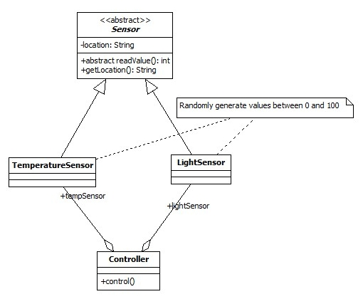
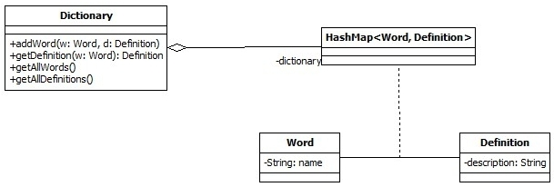

# Exerciții laborator 1 – 2025

## Ex 1.
Scrieți un program care citește 2 numere de la tastatură și afișează maximul dintre ele.

## Ex 2.
Scrieți un joc "Ghicește numărul" în Java. Programul va genera un număr aleatoriu și va cere utilizatorului să-l ghicească. Dacă utilizatorul ghicește numărul, programul se va opri. Dacă utilizatorul nu îl ghicește, programul va afișa: 'Răspuns greșit, numărul tău este prea mare' sau 'Răspuns greșit, numărul tău este prea mic'. Programul va permite utilizatorului maximum 3 încercări, după care se va opri cu mesajul 'Ai pierdut'.

## Ex 3.
O clasă Robot conține:
• O variabilă de instanță 'x' (de tip int) care reprezintă poziția robotului;
• Un constructor implicit care inițializează valoarea la 1;
• O metodă change(int k) care adaugă la valoarea curentă a lui x a robotului k (atâta timp cât k >= 1);
• O metodă toString() care returnează poziția robotului;
Scrieți o clasă care modelează clasa Robot. Scrieți o clasă TestRobot care testează clasa Robot.

## Ex 4.
Implementați aplicația pe baza diagramei de clasă UML de mai jos. Creați o clasă de test pentru testarea programului.
Urmați instrucțiunile și implementați programul conform specificațiilor.

- Implementați aplicația bazată pe diagrama de clasă UML de mai sus;
- Metoda control() va citi și afișa valorile temperaturii și luminozității cu un interval de 1 secundă pentru o durată de 20 de secunde.

## Ex 5.
Implementați un dicționar de cuvinte conform diagramei de mai sus. Creați o clasă ConsoleMenu pentru a oferi interacțiune cu dicționarul. Clasa va furniza acces la funcționalitatea dicționarului printr-o interfață de meniu bazată pe text.

## Ex 6.
Creați o aplicație care permite utilizatorului să introducă un nume de fișier într-un câmp de text, iar apoi, când este apăsat un buton, să afișeze conținutul fișierului într-o zonă de text.
